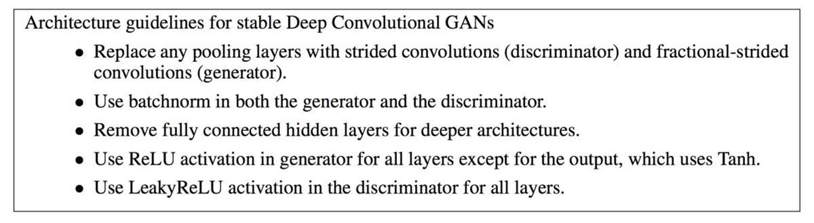

# GanUpsampling
A research paper I authored that introduces the concept of upsampling using Generative Adversarial Neural Networks in order to augment limited image datasets. 

# **A Combinational Study of Discriminative & Generative  Adversarial Neural Network Models to Improve Deep  Learning Results for Food Recognition**

 

**MSc Thesis Project Research Paper** 

Sherif EL Abd

Dr. Maha Saadeh

**A Combinational Study of Discriminative & Generative Adversarial Neural Network Models to Improve Deep Learning Results for Food Recognition** 

 

08/06/2021 

 

 

 

 

​     

 

**Contents** 

Abstract
Introduction
Terminology used
Problem Statement
Objectives 
Literature Review 
Introduction 
Methodology
Research Papers
Methods
Introduction
Data
Proposed Work
Intended contribution of the work .
Benefits of the proposed work 
Procedures and activities of the proposed work 
Evaluation of the project 
Resources needed
Access to participants and clients 
Ethical Aspects 
Work plan and schedule 
Conclusion 
Discussions
Bibliography 
Appendixes 

 

 

 

 

 

 

 

 

 

 

 

 

 

 

# Abstract 

In this study, GANs (Generative Adversarial Neural Networks) are used to attempt to improve the recognition results of healthy plate images. The GANs models are used to generate synthetic data that can be used to augment real training data sets. GANs models have various architectures and methods of implementations. Notably, the CGAN or conditional GANs model is a type of architecture where the class label is leveraged to add information gain to the model. Other notable GAN models are the WGAN, WGAN-GP and DCGAN. Healthy plate recognition problems have been long sought after in the health and fitness industry for athletes and individuals to be able to track their food for logging purposes. The main aim of logging nutritional facts is to be able to make informed decisions on eating habits to improve health and wellness. The main limitations lie in free form healthy plates that do not possess a nutritional table content or a barcode for scanning for easy logging. Traditional attempts to recognize food types via images have fallen short in accuracy due to the lack of deliberate attempts of training discriminative models due to low abundance of data by platform providers. Through this research, it was determined that GAN models can in fact prove to be an effective method of oversampling an imbalanced class. The results of the research show a significant improvement in the recognition rate of a VGG16 transfer learning model in recognizing an imbalanced class from 62% at baseline to 72% after augmenting with synthetically generated data using a WGAN-GP model and 69% using a DCGAN model respectively, without any form of hyperparameter tuning. 

**Chapter 1 – Introduction** 

 

### Problem Statement 

 

The main problem faced with healthy plate scanning is the low recognition rate. Most existing applications leverage discriminative models trained with carefully curated training sets. The problem is that often, users who scan healthy plates in a real-world setting may not perform a scan that fully captures the main features that may fall within the normal distribution of healthy plates. Furthermore, health-conscious users usually eat the same type of food, and they are the users who scan food the most. Thus, leaving a heavily underrepresented variation of foods such as breaded chicken vs healthy grilled chicken. This causes a bias that reduces the likelihood of underrepresented food being correctly recognized. This effectively eliminates food recognition as a viable method of tracking food, which can otherwise be a considered an effective method to alleviate the main barrier to food journaling, which is the high effort needed to manually log food. (Felicia Cordeiro, et al., 2015) 

 

The functional problem being examined in this paper is the use of GAN models as an effective method of over-sampling unbalanced data. Typically, data that has a large disparity between classes is often balanced by the use of traditional data up sampling or down sampling methods. These methods typically consist of either reducing the larger class to match the smaller class. Or generating arbitrary synthetic data from the underrepresented class to match the larger class. This synthetic data would be simply copying an entry from the class and making small changes such as adding a constant value. The problem with these approaches is that valuable data is lost in the case of down sampling or synthetic data that is not representative of the actual data is added to the dataset which may skew the results.  

# GAN Introduction 

Over the course of the study of Data Science and Machine learning, discriminative neural networks were traditionally used to learn, conventionally in a supervised format, in order to produce sufficient output results in a production or experimental setting. The main limitations of discriminative models are the results are usually demonstrated in a model that can either dictate if an object falls into a specific class, or predict a value based on historical evidence and features. This prediction is highly dependent on abundant, representative data. In situations where data is limited, the model’s performance falls short, and the desired output cannot be achieved until further data is gathered. Generative Adversarial Neural Networks (will be referred to as GANs models throughout this paper) is a type of generative model that creates synthetic data from limited data with noise. GANs models have been used to create hyper realistic images and paintings that fall within the representative distribution of key features of a training data set. The main aim of this paper is to explore the potential use case of improving domain image recognition that generally suffers from low abundance of training data typically in the form of unbalanced data. In this scenario, the healthy plate images to detect food types. 

 

 *Fig 1 - GAN Model 1* 

The GAN model typically works by taking in real samples, injects noise along the distribution of the images and creates a new image. This synthetic image is fed into a discriminator that can differentiate between the real and synthetic images. The results are then backpropagated to the generator for fine tuning. 

 

## Terminology used 

 

**GAN** – Refers to Generative Adversarial Neural Network. It’s a type of Neural network that aims to generate data based on real samples (*Refer to introduction section & Methods section)* 

**Discriminator –** Refers to the portion of the GAN model that distinguishes between real and synthetic data as part of the backpropagation process 

 

**cGAN –** Conditional GAN model. This is another type of GAN model that has been expanded to introduce conditions as part of the generative process of the model performance

 

WGAN 

 

WGAN-GP 

 

**SMOTE -** Synthetic Minority Oversampling Technique. Which is a type of method traditionally used for oversampling 

 

**Oversampling/Up sampling/Down sampling –** Are techniques used in data wrangling that aim to balance dataset that have a large disparity between classes. 

 

**ADYSN –** Adaptive Synthetic oversampling. Is another technique used in balancing unbalanced data sets 

 

 

#### Objectives 

The main aim and objective of this paper is to attempt to improve healthy plate recognition methods by exploring and leveraging GANs models that will be able to identify key features of a type of healthy plate, generate representative synthetic data that can then be used to detect food types in a more randomized setting: 

​       

​      **Objective 1**: Determine and analyse a robust GAN model for effective over sampling 

**Objective 2**: Analyse and compare the results of GAN based over sampling against traditional over sampling techniques 

​      **Objective 3:** Commentary and improve results via adjusting the model complexity 

 

**Objective 4:** This project will aim to contribute to the continuous study of improving real world deep learning applications as well as the running studies in identifying potential improvements by combining discriminative and generative models to improve accuracy. Traditionally, discriminative models were viewed as having stronger results when compared to generative models. However, with the advent of GANs models and explorative discriminative/generative methods, the main advantages of both models can be used to achieve a higher result than one type used in isolation. 

 

 

**Chapter 2 - Literature Review**

 

### *Introduction*

 

In the literature review section, a study of the papers most relevant to various aspects of the objectives of this paper have been examined. These objectives and research paper mappings are as follows: 

 

| **Objective Focus Area**          | **Topic of the papers  related**                             |
| --------------------------------- | ------------------------------------------------------------ |
| Tightly related to  Objective 1,3 | Analyse  the design of GAN models and methods of improving performance |
| Tightly related to  Objective 2   | Analysing  the performance of various GAN models and their impact on the output images  for up-sampling |
| Loosely related to  Objective 2   | The  use of non-traditional up-sampling techniques to improve image recognition |
| Loosely related to  Objective 4   | The  introduction of GAN to improve the output of studies limited by lack of data |

 

### Methodology 

 

The method of literature review used in this paper aims to answer two main questions: 

\1.    Are GAN models an effective method of oversampling unbalanced data? 

\2.    Are there any effective methods for oversampling unbalanced data? 

As such, the chain of research papers referenced in the next section all possessed a common goal or frequently had similar references. The main paper that stands out is that of (Ian J. Goodfellow, 2014). As the pioneering paper that brought major advancements in the use of generative models. 

 

The main platforms used for research were mainly the Middlesex university Unihub, the Cornell University database and the various online engineering periodicles such as the IEEE and Towards data science website. 

 

Another method used in this research was to examine referenced research papers within notable research papers. This method of chaining provided a comprehensive background of the history of the research and provided a solid foundation as to how the researchers reached the topic of discussion.   

### Research Papers 

In the academic study conducted at the School of Knowledge Science, Japan Advanced Institute of Science and Technology, Japan (Ba, 2019). The author has attempted to explore a similar problem statement but on fraudulent credit card data that was heavily imbalanced. The fraud cases totalled at 492 out of 284,807 total cases. The paper explored various GANs models, most notably the Conditional GAN model, the Wasserstein GAN model and the WCGAN. The GANs model was used as a method to up-sampled the unbalanced data and the results concluded that the WGAN and the WCGAN provided the best results. 

 

In another academic study (Georgios Douzas, 2018), the authors explore improving the results of an imbalanced dataset, by implementing the process of synthesizing data on the underrepresented features using a cGAN model. In this study, the authors point out that standard learning methods under perform in an unbalanced setting, as the learners become biased to the dominant features and skew the results accordingly. The results of the study outline that the cGAN method of oversampling underrepresented features, outperformed other methods of classifications when given enough time for training. 

 

Of course, the academic paper (Ian J. Goodfellow, 2014) can be credited as the research paper that has brought about the advancements in leveraging generative methods of training. In this paper, Goodfellow et al. propose and experiment with the usage of combining both a generative and a discriminative model in training and pitting them against one another in a game theory style format. The main objective of the experiment is to have the generative and discriminative model try to outsmart each other. The generative model’s objective is to generate synthetic data that falls within the spectrum of distribution of the data and the discriminative model’s objective is to classify if the data is from the original dataset or generated data. 

 

In another study conducted by (Bappaditya Mandal, 2018)*,* the research team implements a study aimed at solving the same objective of this paper. The goal is to improve the recognition aspects of food images by leveraging deep convolutional GANs models that alleviate the limitations in accounting for variations of food representation. As highlighted in the study, the same food type can have different appearances based on the preparation method, ingredients and capture setting. This in turn causes a strong limitation on the accuracy of discriminative neural nets being  

 

In (Zhang, 2015) Dr. Zhang et al. Identify the possibilities in detecting various food types and simultaniously estimating the portion sizes by leveraging support vector machines. Dense HOG and Dense SIFT were feature extraction methods used to extract gradient features that allow for a stronger approach to texture detection. This allowed the researchers to be able to detect food types that have the same color and geenral shape to still be distinguishable. The example used was that of french fries and omllette. 

 

In (Puri, 2009)*,* This study shows the very early stages of the attempt at recognizing food volumes. While this paper does not employ GANs models, it does however use early versions of computer vision models that attempts to capture and estimate food volumes. The main model used in this analysis was a Support Vector Machine (SVM). In this analysis, the research team also enabled voice dictation as a form of data labelling to improve accuracy. 

 

In (Radford, et al., 2016), the authors implement and discuss the use of DCGAN models to augment the earlier results of GAN models by adding deep convolutional layers to the discriminator and the generator to improve the results of unsupervised learning. This paper was especially useful in providing insights into model architecture that can improve the way models perform. An excerpt from the paper is pasted below for convenience: 

 

 

*Fig 2 - GAN Best Practice 1* 

#### (Radford, et al., 2016) 

 

In (Sergey Ioffe, 2015), a valuable method of improving the performance of a model by not just normalizing the input to the network, but also normalizing the inputs to each layer within the network by leveraging the mean and standard deviation of that specific batch. This helps the model to coverage for better results. Furthermore, this concept helps to combat what is known as internal covariate shift, which argues that the distribution of the data, if similar via normalization, will help improve the efficiency of the training of the network.  

 

In (Damien Dablain, et al., 2021), the authors explore the use of DeepSMOTE as a method of over sampling data to balance a dataset. This is a newer advent of oversampling techniques that seeks to improve on the use of GAN models. Traditional SMOTE techniques were not catered towards deep learning. The authors of this paper seek to build a SMOTE methodology that will successfully create new images for deep learning. The result of the study was a successful use of DeepSMOTE to over sample images. With the main limitation being that the data used was a 28x28x1 from the MNIST dataset. 

 

In (Yamaguchi, et al., 2020), the authors argue of a newer method of performing data augmentation using GAN models. The process in this study follows a transfer learning like approach to training GAN models. The process follows the learnings from an outer dataset and transferring them to an inner dataset. This process is dubbed Domain fusion by the authors. The domain being the common context of both datasets, in this case being 

“indoor exploration”. 

 

In (Ming Zheng, et al., 2020), the authors address the issue with basic DCGAN and Conditional GAN models. They compare the commonly used SMOTE with GAN based over sampling and propose the conditional Wasserstein GAN model that can be used to improve the generated images and enhance the quality. The issue with SMOTE is that is creates insufficient realistic data and basic GAN models suffer from mode collapse. CWGAN models in contrast were proven to generate better quality images from the data distribution while also preventing mode collapse. 

 

In, (Ishaan Gulrajani, et al., 2017) the authors propose an improved method of training a Wasserstein GAN. By penalizing the norm of the gradient with respect to its inputs, they introduced a WGAN-GP. This method has proven to be more stable and generalizes better than a WGAN. The paper proves that a WGAN-GP was able also perform better with almost no hyperparameter tuning. The authors argue that the reason standard WGAN models perform worse is due to the arbitrary clipping on the weights of the discriminator. This causes the output to often be of low quality. 

 

In, (John Spencer Ingels, et al., n.d.) the authors prove that consistent tracking of food intake has a very strong and positive correlation with weight loss. The research shows that rare trackers displayed the slowest rate of weight loss, followed by inconsistent trackers. Consistent tracking which results in weight loss has also shown to promote a more food conscious mindset that combats diabetes and heart disease. 

 

In (Felicia Cordeiro, et al., 2015), the authors research barriers to effectively logging food and the challenges end users face which prevent them from food journaling. The result of the research culminates in “Too much effort” being the main reason behind most users not logging their food. This was attributed to limitations in the design of food journaling applications and methods currently. 

 

Finally, in (Anthimopoulos, 2013), the research team highlights the importance of creating an accurate and convenient method to be able to scan food and detect food types in a Multifood plate. This is in attempt to provide a method that allows patients the ability to assess food’s that are safe for insulin resistant individuals. The research team uses CIELAB conversion, pyramidal mean-shift filtering, region growing, region merging, and plate detection/background subtraction to accurately detect the food types. While this study resulted in an 87% accuracy, the required size of the dataset was 13,000 images and was only able to cover 6 food classes. In order to expand the number of food classes, this would require an even larger data set. This paper will attempt to support this research by supporting the training with GANs balanced datasets which would allow for similar recognition but with a smaller dataset.  

 

\#Add table to compare models 

**Chapter 3 – Proposed Methods** 

 

### Introduction 

 

The proposed methodology in this study will follow the main definitions of the Generative Adversarial NNs frameworks outlined by (Ian J. Goodfellow, 2014). This will also be expanded to also incorporate the cGAN framework defined in (Gauthier, 2015). Other variations of the GANs models such as the WGAN and WCGAN will be considered after the baseline has been established using the former frameworks. 

 

The GAN framework definition is outlined as follows. The generator: 

 

 

 

Where the random noise Z is employed by the generator to produce data that falls in the data plane X. The generator attempts to capture the real; data distribution to produce synthetic representative data. Adversarial to the generator, the discriminator, denoted: 

 

 

Where D is the discriminator that aims to classify if the data belongs to the original dataset or has been synthesized by the generator. Fig 1. Illustrates the end-to-end process of a basic or vanilla GANs model. 

 

 *Fig 1 - GAN Model 2* 

The cGAN model would follow a very similar training process. However, an additional data plane would be added to the training data in the form of conditions. This would enable the GAN model to expand the training scenarios of each image by also adding more context to the image, such as the angle the picture was captured or the lighting etc. 

 

The performance of the GAN and cGAN models will be benchmarked against the performance of the generally accepted standard process of balancing imbalanced data, and that is by leveraging SMOTE or Synthetic Minority Oversampling Technique. SMOTE was first introduced in 2002 in the research paper (Chawla, 2002). SMOTE leverages a technique in which the under sampled is generalized via a line of best fit, this line is then used as a reference to synthesize new data that fits along the same line. The major drawback of SMOTE is that it does not consider the overlap between the minority classes and the majority classes. This in turn can create ambiguity in the samples that lie in between. 

 

The second benchmark to be used is the ADASYN or the Adaptive Synthetic Sampling Method. ADASYN calculates the degree of class imbalance: *d = mβ / mα* 

Where *mβ* is the count of the minority class and *mα* is the count of the majority class. The number of synthetic data is then calculated as: 

*G = (mα – mβ) \* σ* 

Where *σ* is a number between 0,1. This number denotes the degree of balancing desired where *σ =1* would generate completely balanced data set. For each element in the minority class, K number of nearest neighbours are identified. This is the core of the ADASN, where the nearest neighbours to the element in the minority class is first identified and then using the degree of balance to create a density distribution that balances the minority classes but would still be representative of the overall dataset. As opposed to the SMOTE method, this will also consider elements from the majority class that may be neighbours to the sampled minority elements when calculating the density ratio (He, 2008). 

 

 

### Data 

 

Throughout this research, the main data source that will be used will be leveraged from the Food 101 dataset (Bossard, 2014). The dataset consists of images of 101 types of food classes. For each class, a total of 1000 images are available with the class label. For the purposes of reducing the complexity of the research, only 4 main categories of food types will be used. These categories are, **Steaks**, **Chicken** **Wings**, **Grilled** **Salmon** and **Apple Pie**. The class sizes will be randomly selected to ensure a class imbalance. A fifth class, **grilled** **chicken**, might be manually scraped and added as the most minor class if needed. This is to ensure that different types of the main class “**Meats**” has different variations. 

 

#### Data Preparation 

 

With the 4 main classes selected from the Food 101 dataset, the main methods of data preparation will require 2 main steps. 

 

**First step:** is to divide each class into a training and testing subset with a division of 80%:20% respectively. Each class in this case will have 800 images to be used for training and 200 images to be used for validation and testing. This step will mainly be setup for creating a baseline to be used as a benchmark for subsequent results after unbalancing then synthetically rebalancing the dataset. 

 

**Second step:** is to randomly select 1-2 classes to be unbalanced by deleting a subset of images from that class. The results of the baseline model after the unbalancing will be noted for future use. 

 

**Third step:** The unbalanced class(s) will be rebalanced using traditional balancing techniques 

 

#### Data Pre-processing 

 

The training and testing images were pre-processed in effort to normalize and improve the accuracy of the model. These pre-processing steps consisted of: 

 

1-   Resizing the images to 244 x 244 as this is the standard and expected input of the 

VGG16 model (to be explained in the next section 

2-   Randomly flipping the images horizontally, in order to increase the variety of the dataset 

3-   A random rotation of 45 degrees to also increase the variety of the dataset 

4-   Normalizing the images to a mean and standard deviation of 0.485 and 0.229 as per the ImageNet standards 

5-   The Training set was split into training and validation 

 

Code snippet: 

 

transform **=** transforms**.**Compose([transforms**.**Resize((244,6 (Inkawhich, 

n.d.)4)),                    transforms**.**ToTensor(),                    transforms**.**RandomHorizontalFlip(),                    transforms**.**RandomRotation(45),                   transforms**.**Normalize(0.485,0.229)])

​       

### Baseline 

 

The baseline for this experiment will be based on a convolutional VGG16 neural network using transfer learning. This network architecture was selected based on its performance and expected output. The basis for this baseline method is to mimic a straightforward approach to creating a simple image classifier leveraging a balanced dataset.  

 

### VGG16 Intro 

 

VGG16 is a widely used convolutional neural network architecture that participated and and achieved a high accuracy of over 92% in the imageNet competition in 2014. It was developed by a group of researchers from the university of Oxford. It consists of 16 layers. 

 

The input to the network is a 244 x 244 x 3 image. This is an RBG image with a length and width of 244 each. 

 

 

*Fig 3 - VGG16 1 (Simonyan & Zisserman, 2014)* 

 

The network consists of convolutional layers with ReLU activation functions reducing in dimensions and increasing in depth via the max pooling layers. And ending with 3 fully connected layers that feed into the output layer of 1000 to classify the original 1000 classes of the ImageNet competition. In our case, the final layer will be removed and a new layer will be added to match the number of classes of our dataset. 

 

The full summary of the imported VGG16 is as follows: 

 

VGG(

 (features): Sequential( 

  (0): Conv2d(3, 64, kernel_size=(3, 3), stride=(1, 1), padding=(1, 1)

)

  (1): ReLU(inplace=True) 

  (2): Conv2d(64, 64, kernel_size=(3, 3), stride=(1, 1), padding=(1, 1

))

  (3): ReLU(inplace=True) 

  (4): MaxPool2d(kernel_size=2, stride=2, padding=0, dilation=1, ceil_ mode=False) 

  (5): Conv2d(64, 128, kernel_size=(3, 3), stride=(1, 1), padding=(1, 

1))

  (6): ReLU(inplace=True) 

  (7): Conv2d(128, 128, kernel_size=(3, 3), stride=(1, 1), padding=(1, 

1))

  (8): ReLU(inplace=True) 

  (9): MaxPool2d(kernel_size=2, stride=2, padding=0, dilation=1, ceil_ mode=False) 

  (10): Conv2d(128, 256, kernel_size=(3, 3), stride=(1, 1), padding=(1

, 1)) 

  (11): ReLU(inplace=True) 

  (12): Conv2d(256, 256, kernel_size=(3, 3), stride=(1, 1), padding=(1

, 1)) 

  (13): ReLU(inplace=True) 

  (14): Conv2d(256, 256, kernel_size=(3, 3), stride=(1, 1), padding=(1

, 1)) 

  (15): ReLU(inplace=True) 

  (16): MaxPool2d(kernel_size=2, stride=2, padding=0, dilation=1, ceil _mode=False) 

  (17): Conv2d(256, 512, kernel_size=(3, 3), stride=(1, 1), padding=(1

, 1)) 

  (18): ReLU(inplace=True) 

  (19): Conv2d(512, 512, kernel_size=(3, 3), stride=(1, 1), padding=(1

, 1)) 

  (20): ReLU(inplace=True) 

  (21): Conv2d(512, 512, kernel_size=(3, 3), stride=(1, 1), padding=(1

, 1)) 

  (22): ReLU(inplace=True) 

  (23): MaxPool2d(kernel_size=2, stride=2, padding=0, dilation=1, ceil _mode=False) 

  (24): Conv2d(512, 512, kernel_size=(3, 3), stride=(1, 1), padding=(1

, 1)) 

  (25): ReLU(inplace=True) 

  (26): Conv2d(512, 512, kernel_size=(3, 3), stride=(1, 1), padding=(1

, 1)) 

  (27): ReLU(inplace=True) 

  (28): Conv2d(512, 512, kernel_size=(3, 3), stride=(1, 1), padding=(1

, 1)) 

  (29): ReLU(inplace=True) 

  (30): MaxPool2d(kernel_size=2, stride=2, padding=0, dilation=1, ceil

_mode=False)

 ) 

 (avgpool): AdaptiveAvgPool2d(output_size=(7, 7)) 

 (classifier): Sequential( 

  (0): Linear(in_features=25088, out_features=4096, bias=True) 

  (1): ReLU(inplace=True) 

  (2): Dropout(p=0.5, inplace=False) 

  (3): Linear(in_features=4096, out_features=4096, bias=True) 

  (4): ReLU(inplace=True) 

  (5): Dropout(p=0.5, inplace=False) 

  (6): Linear(in_features=4096, out_features=1000, bias=True) 

 ) 

)

 

### Model Architecture & Design 

 

After importing the VGG16 pre-trained model, the weights of the model were frozen to preserve the recognition prowess of the model. However, because we are expecting a completely different set of outcomes for the model, the final layer will also have to be dropped and replaced with a more appropriate layer that represents the classes in our dataset, which constitutes a total of 4 classes. 

 

 

First, the feature layers were frozen as follows: 

 

*# Freeze training for all "features" layers* **for** param **in** vgg16**.**features**.**parameters(): 

  param**.**requires_grad **=** **False** 

 

This was done by switching off the models gradient descent parameter. 

 

This was then followed by adding the final layer as discussed above. As displayed in the VGG16 intro section. From the summary of the VGG16 model, we know that the 6th layer of the classifier is the last layer that was dropped and must be replaced with a new layer consisting of 4 outputs. This was done using the code snippet below: 

 

**import** torch.nn **as** nn 

 n_inputs **=** vgg16**.**classifier[6]**.**in_features 

 

*# add last linear layer (n_inputs -> 4 food classes)* last_layer **=** nn**.**Linear(n_inputs, len(classes)) 

 vgg16**.**classifier[6] **=** last_layer 

 

*# if GPU is available, move the model to GPU* **if** train_on_gpu:   vgg16**.**cuda() 

 

This is a helper function that transfers the training to the GPU in order to speed up training time. 

 

*# check to see that your last layer produces the expected number of outputs* print(vgg16**.**classifier[6]**.**out_features) 

*#print(vgg16)* 

 

Because the final layer was not included when freezing the gradient descent parameter, the param.requires_grad is set to True by default. And since we actually want this layer to readjust its weights based on the forward pass and back propagation, we will keep the parameter set to True. 

 

### Criterion Loss Function & Optimizer 

 

The main loss function used for the baseline training is the nn.CrossEntropyLoss(). This is a none binary categorical loss function considering that we have more than 2 classes in our dataset.  

 

The formula for the categorical cross entropy: 

 

 

#### Categorical Cross Entropy 

 

The loss function meant to evaluate the output of the training and leverage the optimizer to readjust the weights based on the loss function. The optimizer in this case that was selected is the optim.SGD(vgg16.classifier.parameters(), lr=0.001). This is a stochastic gradient decent optimizer with a loss rate set to 0.001. This was selected as a starting optimizer based on its simplicity and compute/memory efficiency. 

 

 

 An ADAM optimizer may be used should we hope to increase the batch size running on the GPU memory to increase the training rate.  

 

### Training Process 

 

The process for training the model now that the optimizer and loss functions have been selected will leverage an existing script from pytroch. 

 

We have selected a starting number of epochs to be 50 and will be changed depending on the performance of the model and the expected baseline 

 

Transfer learning notebook adapted from (Udacity, 2021) 

 

\# number of epochs to train the model n_epochs = 50 

 

 

**Track change in validation loss** valid_loss_min = np.Inf train_losses, test_losses = [], [] 

 

 

 

for epoch in range(1, n_epochs+1): 

 

 

Keep track of training and validation loss 

 

  train_loss = 0.0   valid_loss = 0.0 

  

  

**Train the model** 

   vgg16.train()   for data, target in train_loader: 

​    \# move tensors to GPU if CUDA is available 

​    if train_on_gpu: 

​      data, target = data.cuda(), target.cuda()     # clear the gradients of all optimized variables     optimizer.zero_grad() 

​    \# forward pass: compute predicted outputs by passing inputs to the model     output = vgg16(data)     # calculate the batch loss     loss = criterion(output, target) 

​    \# backward pass: compute gradient of the loss with respect to model parameters     loss.backward() 

​    \# perform a single optimization step (parameter update)     optimizer.step()     # update training loss     train_loss += loss.item()*data.size(0)

​    

​    

  

**Validate the model:** 

 

  vgg16.eval()   for data, target in valid_loader: 

​    \# move tensors to GPU if CUDA is available     if train_on_gpu: 

​      data, target = data.cuda(), target.cuda() 

​    \# forward pass: compute predicted outputs by passing inputs to the model     output = vgg16(data)     # calculate the batch loss     loss = criterion(output, target)     # update average validation loss     valid_loss += loss.item()*data.size(0) 

  

 **Calculate average losses:** 

 

  train_loss = train_loss/len(train_loader.dataset)   valid_loss = valid_loss/len(valid_loader.dataset) 

 

 

​    

  \# print training/validation statistics   print('Epoch: {} \tTraining Loss: {:.6f} \tValidation Loss: 

{:.6f}'.format(     epoch, train_loss, valid_loss))   # save model if validation loss has decreased   if valid_loss <= valid_loss_min: 

​    print('Validation loss decreased ({:.6f} --> {:.6f}). Saving model ...'.format(     valid_loss_min,     valid_loss))     torch.save(vgg16.state_dict(), 'model_cifar.pt')     valid_loss_min = valid_loss 

​     train_losses.append(train_loss/len(train_loader))   test_losses.append(valid_loss/len(valid_loader)) 

 

 

**Training Output:** 

 

| Epoch: 1 Training Loss: 1.057829 Validation Loss:  0.226613Validation loss decreased (inf --> 0.226613). Saving model ... |
| ------------------------------------------------------------ |
| Epoch: 2 Training Loss: 0.885226 Validation Loss:  0.196800Validation loss decreased (0.226613 --> 0.196800). Saving model ... |
| Epoch: 3 Training Loss: 0.781628 Validation Loss:  0.175229Validation loss decreased (0.196800 --> 0.175229). Saving model ... |
| Epoch: 4 Training Loss: 0.726605 Validation Loss:  0.162990Validation loss decreased (0.175229 --> 0.162990). Saving model ... |
| Epoch: 5 Training Loss: 0.687307 Validation Loss:  0.149563Validation loss decreased (0.162990 --> 0.149563). Saving model ... |
| Epoch: 6 Training Loss: 0.647697 Validation Loss: 0.151346   |
| Epoch: 7 Training Loss: 0.635893 Validation Loss:  0.137941Validation loss decreased (0.149563 --> 0.137941). Saving model ... |
| Epoch: 8 Training Loss: 0.614210 Validation Loss:  0.133506Validation loss decreased (0.137941 --> 0.133506). Saving model ... |
| Epoch: 9 Training Loss: 0.591085 Validation Loss: 0.133643   |
| Epoch: 10 Training Loss: 0.571388 Validation Loss:  0.130096Validation loss decreased (0.133506 --> 0.130096). Saving model ... |
| Epoch: 11 Training Loss: 0.573913 Validation Loss: 0.130486  |
| Epoch: 12 Training Loss: 0.562498 Validation Loss:  0.124787Validation loss decreased (0.130096 --> 0.124787). Saving model ... |
| Epoch: 13 Training Loss: 0.532529 Validation Loss: 0.127147  |
| Epoch: 14 Training Loss: 0.541610 Validation Loss:  0.124044Validation loss decreased (0.124787 --> 0.124044). Saving model ... |
| Epoch: 15 Training Loss: 0.530294 Validation Loss: 0.123527  |
| ………..                                                        |
| Epoch: 46  Training Loss: 0.411971  Validation Loss: 0.101488 |
| Epoch: 47  Training Loss: 0.400798  Validation Loss: 0.102279 |
| Epoch: 48  Training Loss: 0.388501  Validation Loss: 0.106233 |
| Epoch: 49  Training Loss: 0.393845  Validation Loss: 0.103603 |
| Epoch: 50  Training Loss: 0.393949  Validation Loss: 0.108335 |

*Table 1 - Training Epochs 1* 

**Training & Validation Loss** 

From the above output of the training, we can see a healthy trend between the training and validation loss. This shows us that the model is not over fitting and is learning the key features extracted in our dataset.  

 

A plot of the training and validation losses can be examined for analysis below: 

 *Fig 4 - Loss Plot 1* 

#### Training & Validation Loss 

 

**Final Baseline Results:** 

 

The final accuracy results based on the training script above shows a good baseline to benchmark the output of future training after the oversampling techniques have been applied to the dataset: 

 

 

*Fig 5 - Accuracy Table 1* 

 

This accuracy displays the rate at which the trained model was able to recognize the different food items in the Test dataset which was removed as part of the data preparation section. From these results, we can determine that the model can easily detect Apple pie, chicken wings and Salmon but lags a little bit at a rate of 72% with Steak. 

 

We will consider these results sufficient as a benchmark to assess oversampling techniques moving forward. 

 

### Generative Adversarial Networks 

 

The next step in this body of research, is to adapt a GAN architecture to the targeted dataset. The purpose of this exercise is to establish a working Generator and Discriminator that will successfully learn the basis distribution of the images in Food 101. 

 

#### Data 

 

The data set for this version of GAN has been scaled down to 64 x 64 x 3 images. This is for the purposes of speeding up the training sessions due to limitations in compute. Furthermore, the purpose of this research is to capture the general distribution of the images we want to sample, and not to produce perfect synthetic images for display purposes. The 4 classes had 1000 images each as defined in the Data section of this paper. 

 

  Train  1000                                                                                                                                                                                                                                                                                                                                                                                                                                                                 800  600  400  200  0        Chicken_wings      Steak         Salmon       Apple_Pie  

*Fig 6 - Class Count 1* 

#### DCGAN 

 

The below structure and code are adapted from Pytorch’s tutorial document which outlines the basic structure of a deep convolutional GAN model from (Inkawhich, n.d.). 

 

The architecture consists of a discriminator and generator alternating and attempting to achieve a zero net loss captured via the loss functions of each respective model. 

 

##### Discriminator 

 

The discriminator consists of a basic architecture that belong to a typical convolutional neural network without max pooling layers. The dimensionality reduction occurs on the stride level which is set at a default of (2,2) and a stride on the final layer of (1,1).  

 

 *Fig 7 - Discriminator Architecture 1* 

The discriminator consist of 3 convolutional layers that transform the dimensions of the image tensors into deeper layers. The starting layer transforms the RBG channel from 3 into 64, this then passes through a Leaky ReLU activation function as per the best practices outlines in (Ian J. Goodfellow, 2014). The second layer onwards follow the same process but with a batch normalization function in order to localize the normalization to the specific batch of images for each forward pass. Ultimately, the final output transforms the deep channels from 512 channels into 1. This final layer passes through a sigmoid function that determines if an image is real on synthetic. 

 

The selected Loss function of this discriminator is a Binary Cross Entropy (BCELoss) denoted as follows: 

 

 

 

The reason this was selected is due to having two choices for the discriminator, Real or Fake. 

 

And finally, the optimization functions that will readjust the weights after the forward pass and during the back propagation is an ADAM optimizer function set at a default learning rate of 0.0002. 

 

##### Generator 

 

The second core component of the GAN architecture is that of the generator network. This network architecture was also adapted from (Inkawhich, n.d.). The generator does the opposite of the discriminator’s order of events with a few key differences that will be explained shortly. 

 

 

First, we display the structure of our generator: 

 

*Fig 8 - Generator Architecture 1* 

 

This generator reads in the latent vector of noise that will be read just to adapt into the generated image desired. The noise fed into the model will be converted via a transpose convolutional layer carrying a stride of (1,1) and output a deep layer of 512 channels. This is also followed by batch normalization to impute the mean and standard deviation of that specific batch. This is then followed by 4 layers that will expand the dimensions of the tensors and flatten the input channels from 512 to the final 3 channels denoting RGB. The final output is a 64 x 64 x 3 image that has been recreated by adjusting the weight of the network based on the loss function and optimizer. 

 

The loss function and optimizer used is the same as the discriminator but standalone to compute the loss of the generator and optimize the gradient and hyperparameters of the generator model based on the output of the discriminator (fake or real). 

 

##### DCGAN Training 

 

The training process of the deep convolutional GAN model as explained in the introduction section of this paper is denoted in the image below: 

 

 *Fig 1 - GAN Model 3* 

The generator will read in random noise create by the latent vector and following an OR gate, will feed its output into the discriminator model. The discriminator will determine whether the data is real or fake and the output loss will be fed into the optimizer function that will feedback into the generator for adjustments. The data loader created as part of the data processing will be used to feed in the real samples and the model will be allowed to run for 40 epochs. 

 

Below is a sample of the real data from the food 101 dataset that was prepared: 

 

 

 

*Fig 9 - Food Training Images 1* 

After running for several epochs, the generated images below display the output of the basic GAN model: 

 

 

*Fig 10 - Generated Images 1*

A closer look at the images would show that they are not of any specific type of food. But the GAN model successfully captured the main features of the food that was able to fool an initial glance as well as the discriminator function. 

 

A second approach to training the DCGAN was by reducing the overall dataset to just the class that requires synthetic generation, in this case, we attempted retraining the DCGAN with only the Chicken wings class. And the output was displayed as follows: 

 

 

*Fig 11 - Class Generated Images 1* 

 

From the images alone we can see an impressive display of images that truly captured the features of the chicken wings class. At a first glance, the fake images can easily be mistaken for real images. However, the sharpness of the images lost a bit of quality due to the significantly reduced dataset size. However, this is more realistic as most business cases may not have as many datapoints as the Food101 dataset. As a sanity check, another class was selected for retraining to ensure that the model performs as expected: 

 

 

*Fig 12 - Class Generated Images 2* 

 

 

The steak class also displayed impressive results when used to train the DCGAN model. 

 

***DCGAN Oversampling Improvements:\*** 

 

As previously proposed in the data section, the classes were synthetically imbalanced. 

The Steak group was selected and out of 800 training images, 400 were dropped. 

*Fig 13 - Class Count 2* 

 

 

The baseline CNN was retrained with the imbalanced dataset, and the losses plot was recreated: 

 

 

*Fig 14 - Loss Plot 2* 

 

From the above loss plot, we can see that the validation loss is not as smooth as it was when the classes were balanced with real images. Furthermore, we can see a divergence occurring towards the end epochs, which shows that the model was becoming unstable. This can be further illustrated with the accuracies captured for the classes: 

 

*Fig 15 - Accuracy Table 2* 

 

Due to the imbalance of the dataset, the steak class has dropped significantly in accuracy. 

 

400 images from the Steak class were generated using the CGAN and the Steak class was rebalanced back to 800 images but with a mix of real and synthetic images. 

 

 

*Fig 16 - Loss Plot 3* 

 

*Fig 17 - Accuracy Table 3* 

From the above loss chart and accuracy reading, we can see a significant improvement in the imbalanced class that was rebalanced with synthetically generated data. This brought the accuracy back almost to the baseline that was conducted with real data only. 

 

#### CGAN Training 

For the purposes of this research, the implementation of the Conditional GAN training was kept basic and only as a minor improvement to the above GAN architecture. 

 

The basic concept of a CGAN can be explained with the below illustration from (Guim Perarnau, et al., 2016). 

 

 

*Fig 18 - cGAN Model Architecture 1* 

The Generator and the Discriminator are largely kept the same, with an addition of the labels of the classes fed into the discriminator and the generator model along with the latent vector. This adds an extra dimension to the input channels that also forces the GAN model to define condition-based generation and discrimination. The goal of a CGAN model is that a specific class can be defined, and the GAN model would be able to generate an image with the features of that specific class. This contrasts with a standard GAN model that will generate images based on a mix of all the classes fed into it. Which in this case will not be useful as our classes are wholly different from each other. 

(Damien Dablain, et al., 2021) 

The following amendments were made to the DCGAN model to include the label elements to the Generator layers: 

self.label_emb = nn.Embedding( n_classes,  n_classes) 

 

And in the forward pass block the label is passed as a variable. The same was done in the discriminator declaration. Full code in the appendix section. 

 

The output of the CGAN model gives distinctly separated classes in the images captured from the latest 2 iteration. Below is a plot of the 4 classes generated from the latest models. They are organized into grilles salmon, Steak, chicken wings and Apple pie. 

 

*Fig 19 - cGAN Output 1* 

While the images are not clearly food groups, the intrinsic qualities of the food classes can be seen. However, the quality of the output is clearly not what is expected to oversample a category effectively. 

 

#### WGAN 

 

The Wasserstein GAN was introduced as an extension of the traditional Deep 

Convolutional GAN. The WGAN moves away from the standard discriminator and instead, adds a critic to the output of the generated images. This reduces the need for hyper parameter tuning and in theory should produce more stable training and betterquality images. The loss function produced from the WGAN has a direct correlation to the quality of the images produced by the generator. 

 

*Fig- 20 WGAN 1* 

##### (Huiu, 2018) 

 

The illustration above, taken from (Huiu, 2018), shows the main difference between a standard GAN and a WGAN. The architecture of the critic in comparison to the discriminator is minimal. There is no sigmoid function on the last layer like the discriminator in the GAN model. However, the loss function is different in the sense that it will measure the quality of the generated images, irrespective of how well the critic is performing. This carries two key advantages: 

 

\1.    The model does not suffer from mode collapse (very similar images being generated) 

\2.    The generator will continue to learn even if the critic is performing well 

A weight clipping value of 10 was added and the output is illustrated below: 

 

*Fig - 21 WGAN output 1* 

From the above generated grid of images, the output of the WGAN model was not what was expected. Although in theory, this model should generate a better output than the standard DCGAN model, the architecture of the model will need to be redefined in order to produce the right quality images for this hypothesis. This is because while the weight clipping may prevent an exploding gradient, the training can still be erratic and unpredictable or may take a long time to converge as we have seen above. This was the output generated after 500 epochs on only the steak class, in contrast to the DCGAN which generated far better images at only 200 epochs. 

 

#### WGAN-GP 

 

To improve on the above WGAN architecture, the WGAN-GP model introduced in (Ishaan Gulrajani, et al., 2017). The main difference introduced in WGAN-GP is that the weight of the critic is not arbitrarily clipped but a gradient penalty with respect to the inputs of the critic is used. This allows for a more stable training and better outputs without hyper parameter tuning. The gradient penalty would penalize the model if the points interpolated between the real and fake images more aware from a norm of 1. 

 

##### Updates to the WGAN 

 

A gradient penalty helper function was created and introduced into the existing architecture of the WGAN and replaced the clipping of the weights as outlined in the (Ishaan Gulrajani, et al., 2017) paper and the output after 500 epochs can be illustrated below: 

 

*Fig 22 – Generated Class Images WGAN-GP 1* 

The quality of the images produced exceeded the DCGAN model in this context and effectively addressed the issue faced with the WGAN model that did not have the gradient penalty. 

 

##### WGAN-GP Oversampling Improvements 

The same oversampling process used in the DCGAN section is used with the generated images of the WGAN-GP model to balance the steak class. This was then used in the baseline CNN model and the output illustrated below: 

 

 

*Fig 23- WGAN-GP 1*

 

 

*Fig 24 WGAN-GP Oversampling results 1*

From the above results, we can see that WGAN-GP surpassed the DCGAN results in accuracy based on oversampled data. 

**Chapter 4 - Summary of Results** 

| **Model** | **Epochs Trained** | **Class**   **Accuracy with**   **Imbalanced Data** | **Class**   **Accuracy After**   **Synthetic**   **Images**   **Added** | **Accuracy**   **Improvements from  Baseline** | **Total Accuracy** | **Differentiation**                 |
| --------- | ------------------ | --------------------------------------------------- | ------------------------------------------------------------ | ---------------------------------------------- | ------------------ | ----------------------------------- |
| DCGAN     | 200                | 62%                                                 | 69%                                                          | +7%                                            | 78%                | Deep   Convolutional   Architecture |
| CGAN      | 500                | 62%                                                 |                                                              | -                                              | -                  | Class Embedding                     |
| WGAN      | 500                | 62%                                                 | 47%                                                          | -15%                                           | 58%                | Weight clipping                     |
| WGAN-GP   | 500                | 62%                                                 | 72%                                                          | +10%                                           | 81%                | Gradient Penalty                    |

*Table 2 – Model Results Comparison 1* 

Based on the results of the previous section outlined in the summary table above, the WGAN-GP model produced the best results. The synthetic images created by the generated produced the best-looking images that managed to improve the performance of our baseline VGG16-CNN model that was trained on imbalanced data. The fastest model to converge was the DCGAN that managed to produce good results only after 200 epochs. As for the CGAN model, the results after 500 epochs were not up to par, this may be addressed by also implementing a deep convolutional network, effectively creating a CDCGAN or Conditional Deep Convolutional Neural Network. This may address the issues faced with the standard CGAN that relies on fully connected layers and may capture the futures better. In this case, the results were discarded. For the WGAN model, the arbitrary clipping of the weights as well as changing the sigmoid layer in the discriminator to a linear layer promised preventing a mode collapse and producing better images. The model did not successfully converge after 500 epochs. This was improved by adding a gradient penalty instead and forming the WGAN-GP model. 

### Benefits of the proposed work 

 

The main beneficiary of this work is intended to be health-conscious individuals and individuals who are trying to combat fitness related diseases such as diabetes and obesity. 

The current methods of tracking food consumption require manual input of food details. 

This is cumbersome in a lot of instances and can be heavily under reported (J Macdiarmid, 1998). By eliminating the manual process of inputting the details of the consumed food and enabling a more accurate method of volume and food type classification, this will motivate individuals to be able to track their food more closely and reduce the rate of under reporting. 

 

The secondary beneficiary of this research is the deep learning community and any wider business units that aim to improve the maturity of their data that may be impacted with balancing issues. The reality of data processing and acquisition in standard business settings, is that data maturity will not be ideal. Most data points acquired will be imbalanced in one way or another and biased to a dominant class. The results of this research provides a path forward and opens the door for deep learning applications that may have otherwise been discarded or diminished due to the data imbalance challenge. 

 

#### *Procedures and activities of the work* 

 

The proposed work outcomes are listed in the below table. These outcomes are a best estimate and have been listed as goals based on the information gained in the research so far: 

|      | **Goal**                                                     | **Outcome**                                                  | **Type**   |
| ---- | ------------------------------------------------------------ | ------------------------------------------------------------ | ---------- |
| •    | Successful GAN, cGAN, wGAN and wcGAN-GP   architectures  that successfully generate synthetic data | Pipeline for the  effective preparation and training through the various GAN models created  that achieve an acceptable accuracy | Tangible   |
| •    | Comparative accuracy metrics of the GAN  models              | A list of figures and  charts based on the evaluation metrics listed in section 4.4 | Tangible   |
| •    | Reliable  method of scanning food data via computer vision   | A reliably acceptable  medium of scanning food for logging and tracking | Intangible |
| •    | An addition  to the body of knowledge currently researching enhancing computer vision  methods via GAN based balancing | A conclusion to the  research that may point to or confirm a hypothesis on the right direction to  follow for improving the accuracy of imbalanced data relying on scarce data | Intangible |

*Table 3 - Objectives Outcome 1* 

### Resources used 

The main resources used for this research was hardware based. Python was the main programming language used to design and implement the architecture and models as well as the evaluation methods in this project. The hardware used is a GPU enabled virtual machine(s). 

 

For this purpose, a cloud-based data science virtual machine with two NVIDIA Tesla T4 GPU was leveraged for the experimentation compute.  

 

**Chapter 5 - Conclusion** 

### Discussions 

To conclude with, the task of balancing data via GAN models shows great promise in enabling applications that were undermined by the scarcity of minority classes. The food recognition attempts have previously been dogged by this scarcity, GANs shows promise in providing a solution to this issue which may lead to benefits to many who suffer from irregular and uninformed eating habits. 

From the results displayed of the output of the methods section, the hypothesis we had set out to prove was conclusive. GANs are an effective method of over sampling imbalanced data and combating data sparsity. This issue especially affects the food tracking process in the fitness industry. As stated in the research paper (J Macdiarmid, 1998) and (Felicia Cordeiro, et al., 2015), the main barrier for people journaling their food is that it’s too much effort. Most people starting off on their fitness journey would not be able to correctly estimate portion sizes. Furthermore, many users would report logging their food after the fact, and many would forget what they consumed throughout the day, opting to put off journaling later in the day as it will consumer time. Simply snapping a picture of the food and having the application recognize the food classes and logging them was challenged due to food journaling application providers having insufficient data of some food classes. This forms a sever imbalance of data, with the main and common food groups heavily skewing the machine learning and deep learning models. This in turn, has created a lack of reliability with picture snapping journaling applications. In this paper, we have effectively proven the advantage gained by employing GAN models to learn the distribution of data and generate images of diminished food groups, and closing the gap in accuracy 

 

### Managerial Implications 

 

While the research mainly aims to contribute to the current research base around effective oversampling methods, and a direct addition to the fitness and wellness sector, the implications of this research on corporations that promote healthy living and solutions for combating obesity and heart disease is significant. 

 

Organizations that can leverage this method of balancing diminished datasets to open new avenues for the introduction of machine learning and deep learning as a solution. The fitness and health industry are highly data driven, and the availability of mature, well-structured and indicative data is a prerequisite to any robust product that aims to promote health. Previous applications that had to be discarded or put on pause due to data unavailability, may very well be progressed if the data maturity issue can be addressed by leveraging GAN based over sampling methods. 

 

### Theoretical Implications 

The invention of GAN models dates to 2014 by (Ian J. Goodfellow, 2014). Since then, new and improved methods of GAN have been created that are increasingly producing more realistic data. The recent introduction of more sophisticated GAN models has allowed for the possibility of producing never before seen Art, Images and even human faces. The theoretical possibilities of GAN models outside of the fitness and food industry is numerous, and the research behind generating synthetic data is continuous and will expand the possibilities further. 

 

The health and wellness industry calls for better products and services that aims to alleviate the effort from users in order to effectively log their food journaling. This would increase the adoptability of food journaling by those who were otherwise deterred due to the effort required. An increase in adoptability would also increase the level of real mature data, as well as the acquisition of new types of data that may be fresh and unexplored and would effectively form a domino effect that would feed back into more research that can help reduce the risk of obesity and heart disease through new methods. GAN models can produce data that lies on the distribution of the data fed into it during the training process, in theory if that distribution can be expanded, then GAN models may someday produce external possibilities outside of a given distribution, thus expanding a dataset to include parts of a distribution that lies in the population but not in the sample used for training. 

 

 

### Limitations 

#### Data 

The main limitation in this research paper is the dataset. The dataset used only consisted of 1000 images of each class. These images were free form and not of the highest quality. The lighting effects and the placement of the food in the image was highly irregular and required more pre-processing in order to effectively clean the data well. 

 

#### Pre-processing 

The pre-processing aspect was kept to a minimum in this research, as the main aim of the research was to centred more on the oversampling and generative aspect. This may have negatively affected the performance of the models outlined in the research. Further preprocessing may have improved the performance. 

 

#### Models 

More sophisticated GAN models have been developed and researched that can produce better results than the ones outlined in this paper. However, the main goal of the paper was to prove that GAN models in general can be used as an effective oversampling method for underrepresented classes. In this case addressing a problem faced in the health and wellness industry around specific food groups not being recognized well due to a class imbalance and data scarcity/ 

 

#### Computation Time 

The computational time on average of each training cycle was ~289 minutes. This is not considering failed runs and debugging time. The was due to a limitation in GPU quality and availability. Hence, the number of iterations or Epochs had to be limited in order to address the main goals of the research within the time frame. Higher grade GPUs may be able to perform the training cycles faster and for more iterations, which may result in even better performance and more time to research further models.  

 

#### Future Work 

The intended future work to be carried out will be to expand on improving the results of the GAN models. In this paper, the main objective was to prove the validity and efficacy of using generated images to oversample data for deep learning purposes. Through these methods, it is intended for the next stage of this research to improve the results of deep learning models by adding an extra step to the data augmentation which is usually carried out after the baseline to improve model results. If GAN models can be optimized enough to not require hyperparameter tuning, then a GAN step can be added to the data augmentation step during data pre-processing to also increase the total size of a dataset and push the accuracy results to higher than what would have been achieved by real data points only. The WGAN-GP model has proven that GAN generated images can be achieved without any hyperparameter tuning to output great results. Future work will be to package these models into a package function to be called during the “Transforms” step. 

**Bibliography** 

**(Anthimopoulos, 2013)** 

Agarwal, R., 2019. *The 5 Classification Evaluation metrics every Data Scientist must know.* [Online] 

Available at: https://towardsdatascience.com/the-5-classification-evaluation-metrics-youmust-know-aa97784ff226 [Accessed 2021]. 

Anthimopoulos, M. a. D. J. a. D. P. a. M. S., 2013. Segmentation and recognition of multi-food meal images for carbohydrate counting. *13th IEEE International Conference on BioInformatics and BioEngineering,* pp. 1-4. 

Ba, H., 2019. Improving Detection of Credit Card Fraudulent Transactions using Generative. *CoRR,* Volume abs/1907.03355. 

Bappaditya Mandal, N. B. P. A. V., 2018. *Deep Convolutional Generative Adversarial Network Based Food Recognition Using Partially Labeled Data ,* Staffordshire: School of Computing and Mathematics, Keele University, Staffordshire ST5 5BG, United Kingdom. 

Bossard, L. a. G. M. a. V. G. L., 2014. *Food-101 -- Mining Discriminative Components with Random Forest.* s.l.:s.n. 

Chawla, N. V. a. B. K. W. a. H. L. O. a. K. W. P., 2002. SMOTE: Synthetic Minority Over-sampling Technique. *Journal of Artificial Intelligence Research,* Volume 16, p. 

321–357. 

Damien Dablain, Bartosz Krawczyk & Nitesh V. Chawla, 2021. DeepSMOTE: Fusing Deep Learning and SMOTE for Imbalanced Data. 

Felicia Cordeiro, et al., 2015. Barriers and Negative Nudges: Exploring Challenges in Food Journaling. 

Gauthier, J., 2015. Conditional generative adversarial nets for convolutional face generation. *r Stanford CS231N: Convolutional Neural Networks for Visual Recognition,*. Georgios Douzas, F. B., 2018. Effective data generation for imbalanced learning using conditional generative adversarial networks. *Expert Systems with Applications,* Volume 91, pp. 464-471. 

Guim Perarnau, Joost van de Weijer, Bogdan Raducanu & Jose M. Álvarez, 2016. 

Invertible Conditional GANs for image editing. 

He, H. a. B. Y. a. G. E. a. L. S., 2008. ADASYN: Adaptive Synthetic Sampling Approach for Imbalanced Learning. *Proceedings of the International Joint Conference on Neural Networks,* pp. 1322 - 1328. 

Huiu, J., 2018. *Wasserstein GAN & WGAN-GP.* [Online] 

Available at: https://jonathan-hui.medium.com/gan-wasserstein-gan-wgan-gp6a1a2aa1b490 [Accessed 2021]. 

Ian J. Goodfellow, J. P.-A., 2014. *Generative Adversarial Nets,* Montreal: Departement d’informatique et de recherche op ´ erationnelle, Universite de Montr ´ eal . Inkawhich, N., n.d. *DCGAN TUTORIAL.* [Online] 

Available at: https://pytorch.org/tutorials/beginner/dcgan_faces_tutorial.html [Accessed 19 12 2021]. 

Ishaan Gulrajani, et al., 2017. Improved Training of Wasserstein GANs. J Macdiarmid, J. B., 1998. Assessing dietary intake: Who, what and why of underreporting. *Nutrition Research Reviews,* Volume 11, pp. 231-253. 

John Spencer Ingels, et al., n.d. The Effect of Adherence to Dietary Tracking on Weight Loss: Using HLM to Model Weight Loss over Time. Volume 2017. 

Ming Zheng, et al., 2020. Conditional Wasserstein generative adversarial networkgradient penalty-based approach to alleviating imbalanced data classification. 

*Information Sciences,* Volume 512. 

Puri, M. a. Z. Z. a. Y. Q. a. D. A. a. S. H., 2009. Recognition and volume estimation of food intake using a mobile device. *2009 Workshop on Applications of Computer Vision (WACV),* pp. 1-8. 

Radford, A., Metz, . L. & Chintala, S., 2016. *UNSUPERVISED REPRESENTATION* 

*LEARNING WITH DEEP CONVOLUTIONAL GENERATIVE ADVERSARIAL NETWORKS.* s.l., ICLR. 

Sergey Ioffe, C. S., 2015. *Batch Normalization: Accelerating Deep Network Training by Reducing Internal Covariate Shift.* s.l., s.n. 

Simonyan, K. & Zisserman, A., 2014. *VERY DEEP CONVOLUTIONAL NETWORKS FOR LARGE-SCALE IMAGE RECOGNITION.* s.l., s.n. 

Xiaodong Liu, T. L. R. Z. D. W. Y. L. Z. Y., 2021. A GAN and Feature Selection-Based Oversampling Technique for Intrusion Detection. *Security and Communication Networks,* p. 15. 

Yamaguchi, S., Kanai, S. & Eda, T., 2020. Effective Data Augmentation with MultiDomain Learning GANs. *AAAI Technical Track: Machine Learning,* Volume Vol. 34 No. 04: AAAI-20 Technical Tracks 4 . 

Zhang, W. e. a., 2015. ‘“Snap-n-Eat” : Food Recognition and Nutrition Estimation on a Smartphone. *Journal of Diabetes Science and Technology,* Volume 9, pp. 525-533. 

 

 
